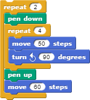

# Lesson 2.2: Nested Loops

## Learning Objectives

Students will be able to...

* Use nested loops to solve programming problems

## Materials/Preparation

* [Do Now 2.2: Debugging Loops](do_now_22.md)
* Lab 2.2 handout - [Yellow Brick Road](lab_22.md) \([Download in Word](https://github.com/TEALSK12/introduction-to-computer-science/raw/master/Unit%202%20Word/Lab%202.2%20Yellow%20Brick%20Road.docx)\) \([Link to PDF](https://github.com/TEALSK12/introduction-to-computer-science/raw/master/Unit%202%20PDF/Lab%202.2%20Yellow%20Brick%20Road.pdf)\)
* [Unit 2 Tips](https://github.com/doingweb/introduction-to-computer-science/tree/2be097d7d27009602b7796d96f71602e46923ac4/unit_2_tips.md)

## Pacing Guide

| Duration | Description |
| :--- | :--- |
| 5 minutes | Welcome, attendance, bell work, announcements |
| 15 minutes | Review, lecture, and examples |
| 25 minutes | Activity - Yellow Brick Road |
| 10 minutes | Debrief and wrap-up |

## Instructor's Notes

1. Review
   * Ask to students to restate the definition of "loop"
     * _A type of block that causes other code to run multiple times in succession_
   * Ask students to explain why loops are useful in programming
     * To reduce code redundancy and increase readability when dealing with repetitive tasks
   * Solicit examples of problems that can be solved with loops
     * Drawing polygons, repeating an action, etc.
   * Ask students how their scripts to draw shapes improved when they introduced loops
     * Code became shorter and more readable
     * Small changes, such as altering the size of the shape, became simpler
2. Lecture 1. Ask students to consider the problem of drawing two squares next to each other
   * Work through writing a script to do this. The likely result will duplicate the code to draw a single square:

     

   * Remind students to remember what they previously learned and use loops
   * Once the script is complete, ask students if there are ways they could improve the code

   1. Discuss what would happen if you needed to draw 10 squares, or 100, or an unknown number.
      * If students seem capable, you can allude to user input for the unknown number example, but do not get into details at this point
      * Ask if loops can somehow be applied to reduce redundancy even further in the script to draw two squares
   2. Introduce the concept of nested loops
      * Define "nested loop" - _a loop used inside the body of another loop_
      * Point out that there is nothing particularly special happening here-- the body of a loop can contain any code, including another loop
      * Emphasize that the inner loop will run all its iterations _each time_ the outer loop runs.
   3. Walk through rewriting the script to draw multiple squares to use nested loops:

      

      * Ask how many total times the sprite will move 50 steps
        * The sprite will move 50 steps 8 times \(4 \* 2\)
      * Show that the number of squares drawn can be easily changed by simply changing the number of times the outer loop iterates
3. Activity
   * Direct students to complete the ["Yellow Brick Road"](lab_22.md) activity individually or in pairs. Try to pair students that have not previously interacted.  
     * Remind students to continue using the principles learned with basic loops
     * Encourage students to write scripts that are as short and succinct as possible while still being functional and readable
4. Debrief
   * Show a student's solution
     * Either request a volunteer or cold call alternative
     * Point out uses of nested loops
   * Ask students to describe how loops, specifically nested loops, made the assignment easier
     * Each brick, or at least each row, would have needed to be coded separately creating much longer scripts
   * Ask students to think about what code would need to change to alter the size of each brick or the size of the road and how that was made easier with loops
     * Size of road: number of iterations in one or both loops
     * Size of brick: one or both move blocks **and** number of iterations in one or both loops
     * Without loops, the change would have been needed in many different places

## Accommodation/Differentiation

* Not all students will recognize all the possible places to use nested loops in the final program.  Encourage students to find as many places to use a nested loop as possible, but allow struggling students to focus on just one or two uses.
* Advanced students can be encouraged to change the size of the bricks, which will require not only altering the number of steps moved but also the number if iterations in the loops.  You can also ask students to draw a building/house using only squares.  For example, they can be instructed to draw where they live, favorite building, or school.  

## Sample Solution

[Lab 2.2 Solution](https://github.com/TEALSK12/introduction-to-computer-science-instructor/blob/master/curriculum/Sample%20Project%20Solutions.md)

## Forum discussion

 [Lesson 2.2 Nested Loops \(TEALS Discourse account required\).](http://forums.tealsk12.org/c/intro-unit-2-loops/lesson-2-2-nested-loops)

